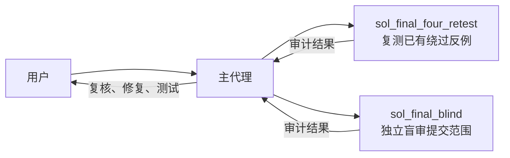
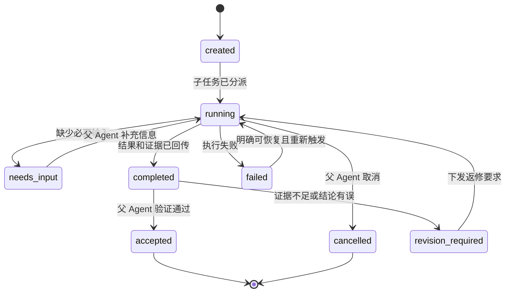
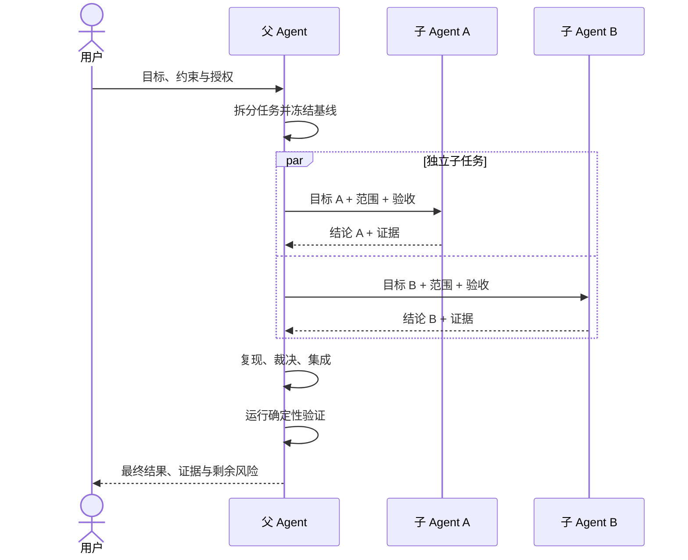

# 父子 Agent 协作设计与实践指南

本文说明如何在一个主任务内部使用父 Agent 和子 Agent 协作。重点不是把任务交给更多模型，
而是判断何时值得拆分、如何限制子任务、怎样传递状态与证据，以及父 Agent 如何承担最终责任。

这里的“父子”描述的是任务编排关系，不代表模型能力高低：父 Agent 负责全局目标、分派、
集成和最终答复；子 Agent 在独立上下文中完成一个边界清晰的子任务，并把结论和证据回传。

## 1. 核心概念

父子 Agent 协作可以理解为一个带有独立工作上下文的函数调用：

```text
父 Agent：定义输入、约束和验收条件
    ↓
子 Agent：独立分析或执行，生成结果和证据
    ↓
父 Agent：验证结果、处理冲突、形成最终决策
```

父 Agent 通常负责：

- 保持用户目标、约束和任务全局状态；
- 判断哪些工作可以安全拆分；
- 为每个子任务指定范围、输入、禁止事项和完成条件；
- 接收子 Agent 的消息和最终结果；
- 复核证据，解决不同结论之间的冲突；
- 管理共享工作区中的修改并完成最终交付。

子 Agent 通常负责：

- 在自己的上下文中处理一个具体、有限的任务；
- 只读取完成该任务所需的材料；
- 按约定格式报告发现、证据、不确定性和剩余风险；
- 不擅自扩大任务范围，也不把局部判断冒充最终结论。

子 Agent 与用户在侧边栏创建的独立任务并不完全相同。子 Agent 是当前主任务内部的执行单元，
结果默认回到父 Agent；独立任务则有自己的对话和生命周期，用户可以直接进入并继续交互。

## 2. 什么时候值得使用

是否拆分应由收益决定。增加一个 Agent 会增加上下文读取、协调、消息回传和复核成本。

### 2.1 适合使用的场景

| 场景 | 拆分方式 | 主要收益 |
|---|---|---|
| 多个方向可独立调查 | 按模块、风险类别或资料源拆分 | 并行缩短等待时间 |
| 需要独立观点 | 一个执行或修复，另一个在少背景条件下盲审 | 减少确认偏差 |
| 子任务边界清晰 | 例如只检查认证链、只验证迁移脚本 | 降低单个上下文负担 |
| 实现量大而验收明确 | 子 Agent 实现，父 Agent 用测试和 diff 验收 | 提高执行吞吐量 |
| 专业能力或权限不同 | 按工具权限、数据权限或专业领域拆分 | 落实最小权限 |
| 长任务需要阶段性交接 | 子 Agent 输出稳定制品和接力摘要 | 避免主上下文持续膨胀 |

安全审计是典型场景。不同子 Agent 可以分别检查授权边界、持久化完整性和输入资源限制；
也可以让一个子 Agent 重放已知攻击，另一个只看最终 diff 寻找新问题。

### 2.2 不适合使用的场景

- 一处明显的小改动，协调成本高于直接完成；
- 多个步骤强依赖同一份探索状态，无法形成稳定接口；
- 多个 Agent 必须同时修改相同文件或相同代码段；
- 需求仍在快速变化，子任务输入很快失效；
- 没有可验证的输出或验收标准，只能让父 Agent 重做一遍；
- 拆分只是给相同工作换不同“职位”名称，没有信息、权限或执行边界；
- 目标是节省 token，但每个 Agent 都必须读取几乎相同的完整上下文。

一个实用判断方法是检查四个问题：

1. 子任务能否用一段简短文字完整定义？
2. 子 Agent 能否在不频繁询问父 Agent 的情况下完成？
3. 输出能否用测试、定位证据或明确标准验收？
4. 并行、独立性或专业分工带来的收益是否大于交接成本？

四项大多为“是”时才值得拆分。

## 3. 示例：两轮最终复审

下面是本项目第五轮修复完成后使用的父子 Agent 流程。两个子 Agent 使用相同模型配置，
但收到不同任务，以获得两类互补证据：一个重放已知绕过反例，一个独立盲审新提交。



这两个子任务可以并行，因为它们都是只读审查，不会争用代码修改权。它们的目标也不重复：

- `sol_final_four_retest` 检查已经知道的攻击路径是否仍能绕过修复；
- `sol_final_blind` 尽量减少先验结论，只依据提交范围和代码寻找新缺陷；
- 主 Agent 负责判断报告是否成立、修改代码、运行测试和向用户交付。

本次盲审发现了更深层的问题，例如通过底层属性访问取得 Proxy target、用旧的完整签名文件
回放 History，以及 Dataset Anchor 没有绑定具体发布。子 Agent 的发现并没有自动成为最终
结论；主 Agent 复现后才实施修复并完成全量验证。

## 4. 如何写好子任务

一个好的子任务应包含六项信息：

| 字段 | 要回答的问题 |
|---|---|
| 目标 | 子 Agent 最终要判断或产出什么？ |
| 范围 | 可以查看或修改哪些文件、提交或模块？ |
| 输入基线 | 应以哪个 commit、文档或测试结果为准？ |
| 约束 | 禁止访问什么，禁止执行什么？ |
| 验收 | 什么证据足以证明完成？ |
| 回传格式 | 父 Agent 希望收到哪些字段？ |

只写“帮我审一下”会让子 Agent 自行猜测范围。更好的审计提示词如下：

```text
任务：独立盲审 BASE..HEAD 的代码变更。

目标：寻找能够绕过安全约束、破坏持久化完整性或导致验证假阳性的缺陷。
范围：只读检查指定 diff 及其直接调用点；不要修改文件。
基线：BASE=<完整 commit>，HEAD=<完整 commit>。
约束：不访问网络、真实模型或真实设备；不运行全量测试。
验收：每项发现必须给出严重级别、文件与位置、可复现路径、影响和最小修复方向。
回传：若没有有效发现，明确写“未发现”；区分已证实问题和待验证怀疑。
```

实现型子任务还要明确文件所有权，避免多个 Agent 同时写相同区域：

```text
任务：修复 History 截尾和回放攻击。
允许修改：evaluation/history.py 及其直接测试。
禁止修改：发布协议、CLI 和其他评测指标。
完成条件：增加可复现攻击测试；局部测试和静态检查通过；提交一个原子 commit。
回传：commit、变更文件、测试命令与退出码、剩余风险。
```

## 5. 状态如何管理

父 Agent 应维护权威状态，子 Agent 只报告自身状态。不能把“子 Agent 已完成”等同于“主任务
已完成”。推荐的生命周期如下：



父 Agent 至少记录以下信息：

```yaml
task_id: sol_final_blind
parent_task: fifth_round_final_review
objective: 独立盲审新提交范围
base_commit: 93529bb...
head_commit: 0185a6a...
mode: read_only
status: completed
owner: child_agent
artifacts: []
findings_received: true
parent_verdict: accepted
```

状态管理有五条关键规则：

1. **父 Agent 是任务状态的唯一裁决者。** 子 Agent 可以声明完成，父 Agent 必须验收后才接受。
2. **状态和制品分开。** `completed` 表示子 Agent 停止执行；报告、commit、测试结果是独立证据。
3. **绑定稳定基线。** 代码审查必须携带完整 base/head；否则回传可能针对已经变化的代码。
4. **终态驱动后续动作。** 等待 `completed`、`failed` 或 `needs_input` 等事件，避免反复轮询日志。
5. **限制重试。** 重试必须说明上次失败原因和新增信息，防止两个 Agent 形成无限对话循环。

共享工作区还需要修改权规则：

- 默认一个文件在同一时段只有一个写入者；
- 审计 Agent 使用只读模式；
- 并行实现按互不重叠的模块拆分；
- 父 Agent 在合并前检查工作区、diff 和 commit；
- 子 Agent 不应自行 push、部署、访问生产数据或扩大外部权限。

## 6. 消息如何传递和回传

消息分为两类。

### 6.1 父 Agent 发给子 Agent

- **初始任务**：创建子 Agent 时给出完整任务契约；
- **补充消息**：增加线索或回答问题，但不改变核心目标；
- **后续任务**：子 Agent 空闲后触发一轮新的工作，例如根据审计结论复查；
- **中断**：任务已失效、方向错误或产生资源冲突时停止执行。

如果补充内容改变了范围、基线或验收条件，父 Agent 应明确声明任务版本变化，不能让子 Agent
把旧结论用于新基线。

### 6.2 子 Agent 回传父 Agent

过程消息适合报告关键阻塞或高价值发现；最终回传应短而完整。推荐结构：

```yaml
task_id: sol_final_blind
status: completed
baseline:
  base: 93529bb...
  head: 0185a6a...
verdict: changes_required
findings:
  - severity: high
    title: History 可以回放旧的完整签名文件
    evidence:
      file: src/.../history.py
      location: load verification path
      reproduction: 用先前保存的合法文件覆盖当前文件，认证仍通过
    impact: 已追加的审计历史可以被整体回退
    suggested_fix: 在文件外保存并验证可信 head
validation:
  commands: []
  limitations:
    - 未访问真实设备
```

回传应遵循以下原则：

- 传递结论和定位证据，不回灌完整思考过程与冗长日志；
- 明确区分事实、推断和未验证假设；
- 代码任务携带完整 commit，而不是“最新版本”；
- 测试结果包含命令、退出码和必要摘要；
- 发现问题时提供可复现路径，不能只给抽象风险描述；
- 没有发现也要说明检查范围和局限，避免被解释为全面安全保证。

## 7. 父 Agent 如何验收回传

父 Agent 收到消息后应执行四步：

1. **校验身份和基线**：确认结果属于预期子任务，并且 base/head 没有漂移；
2. **核对证据**：定位代码、复现反例或检查生成制品，排除误报；
3. **处理冲突**：多个子 Agent 结论不同时，根据证据裁决，必要时分派范围更窄的复核；
4. **完成集成**：修改、测试、提交，并把已证实结果转化为面向用户的结论。

父 Agent 不应直接复制子 Agent 的最终文字。它需要把局部结果放回全局约束中判断。例如，
子 Agent 建议增加网络探测，但用户明确禁止外部网络时，父 Agent 必须拒绝该执行方式并寻找
离线验证方案。

## 8. 常见失败模式

| 失败模式 | 表现 | 修正方法 |
|---|---|---|
| 任务过宽 | 子 Agent 重读整个仓库后给出泛泛结论 | 缩小到单一目标和明确提交范围 |
| 名义独立 | “盲审”收到完整修复思路和预期答案 | 只提供必要基线、约束和验收标准 |
| 修改冲突 | 多个 Agent 同时编辑相同文件 | 指定文件所有权或改为串行 |
| 完成即采信 | 子 Agent 声称测试通过，父 Agent 直接交付 | 父 Agent 核验退出码、diff 和关键反例 |
| 消息回灌 | 完整日志进入父上下文 | 回传摘要、稳定路径和精确证据 |
| 基线漂移 | 审计结论对应旧 HEAD | 每条审查结果绑定 base/head |
| 无限返修 | 父子之间重复发送相同意见 | 设置最大轮次和接管条件 |
| 权限扩散 | 子 Agent 自行访问设备、网络或凭证 | 创建时固定权限和禁止事项 |
| 伪并行 | 子任务互相等待或依赖未完成修改 | 只并行真正独立的工作 |

## 9. 推荐的完整工作流



实际执行时可以使用这份检查表：

### 分派前

- [ ] 子任务具有独立价值，收益高于协调成本；
- [ ] 目标、范围、基线、权限和完成条件明确；
- [ ] 并行任务不会争用同一修改区域；
- [ ] 父 Agent 保留最终集成和裁决责任。

### 运行中

- [ ] 只在出现发现、阻塞或终态时传递消息；
- [ ] 范围变化时更新任务版本和基线；
- [ ] 不通过频繁日志轮询判断存活；
- [ ] 不让子 Agent 之间形成无界自由对话。

### 回传后

- [ ] 检查结果是否绑定正确 base/head；
- [ ] 对高风险结论做最小复现；
- [ ] 独立验证 commit、测试和工作区状态；
- [ ] 向用户报告已证实结论、验证范围和实际剩余风险。

## 10. 设计原则

成熟的父子 Agent 协作不是让多个模型互相聊天，而是建立可控的任务协议：

- 按独立信息和可验证产出拆分，而不是按虚构职位拆分；
- 用最小上下文完成子任务，用精确证据完成回传；
- 权限、预算、基线和状态由父 Agent 或确定性编排层控制；
- 子 Agent 提供专业判断，父 Agent 承担验证、集成和最终责任；
- 多 Agent 用来换取并行度、独立性或覆盖率，不预设它一定节省成本。

当任务无法形成清晰的输入、输出和验收边界时，保持单 Agent 连续执行通常更可靠。
