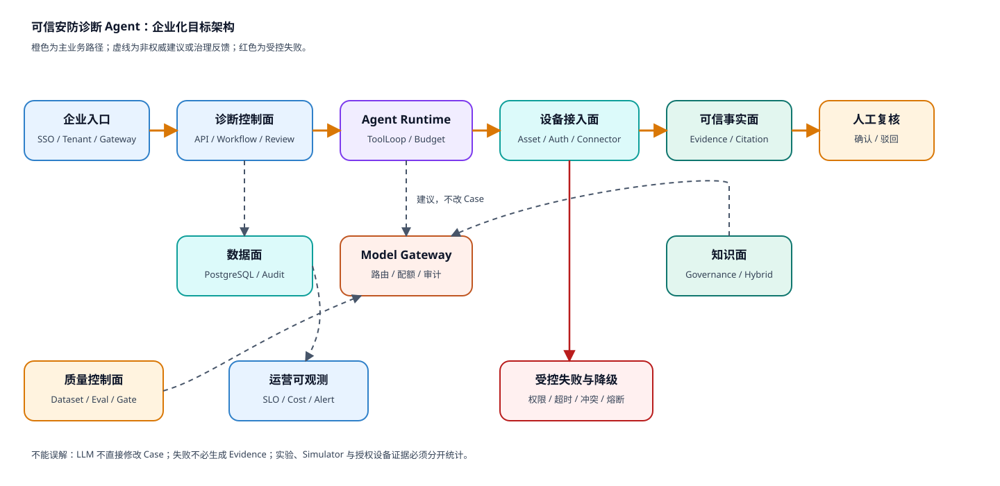

# 可信安防诊断 Agent 企业化目标架构

> SVG 成品：[enterprise-evolution-target.svg](./enterprise-evolution-target.svg)
> Graphviz 语义源：[enterprise-evolution-target.dot](./enterprise-evolution-target.dot)

## 1. 这张图回答什么问题

当前 Harness 如何从单机、受控实验和单设备协议验证，演进为具备企业身份、租户隔离、设备接入治理、可靠数据面、
模型治理、质量门禁和运营可观测的生产系统。

## 2. 读图顺序

沿橙色主路径从企业入口进入诊断控制面，经 Agent Runtime、设备接入面得到可信事实，最后由有身份的人完成复核。
下方模块承担数据、模型、知识、质量和运营治理，不是旁路装饰。

## 3. 关键边界

- LLM 通过 Model Gateway 提建议，不直接修改 DiagnosisCase。
- 设备失败进入受控失败与降级，不必生成 Evidence。
- 人工复核绑定企业身份、角色和租户。
- 知识召回保持 confirmed-only。
- 评测门禁区分合成、Simulator、真实模型和授权设备证据。

## 4. 不能误解什么

这不是要求一次性建设所有中台。企业化首先是把真实用户、真实资产、真实责任和运行 SLO 接入已有可信内核；
微服务、消息队列、向量数据库和 Kubernetes 只有在负载与组织边界证明需要后才引入。

## 5. 面试表达

“企业化不是继续增加故障类型，而是补齐企业身份、租户、设备连接治理、生产数据面、模型网关、可观测与发布门禁。
LLM 仍只负责概率规划，事实、状态和责任继续由确定性系统控制。”
