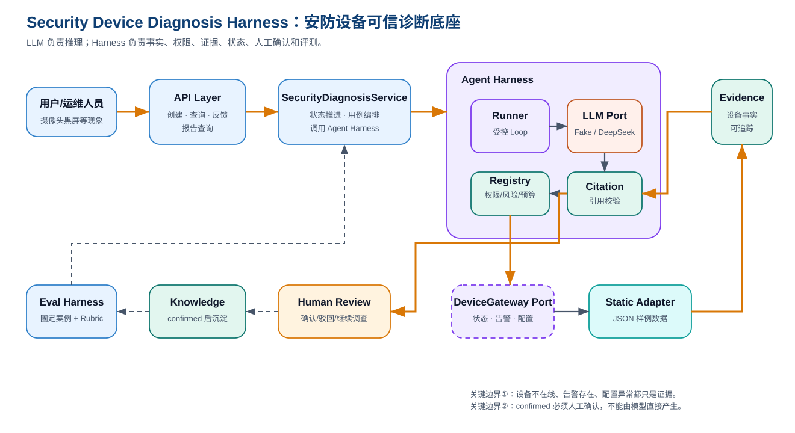

# 安防设备诊断 Harness 总览

> SVG 成品：[security-device-diagnosis-harness-overview.svg](./security-device-diagnosis-harness-overview.svg)
> Graphviz 语义源：[security-device-diagnosis-harness-overview.dot](./security-device-diagnosis-harness-overview.dot)

## 1. 这张图回答什么问题

这张图说明新项目如何把 LLM 约束在一个面向安防设备诊断的 Harness 中：用户输入不是直接进入模型，而是经过应用编排、设备事实采集、Evidence 留存、引用校验和人工确认，最终形成可信诊断闭环。

## 2. 读图顺序

1. 用户提交设备故障，例如“3 号楼摄像头黑屏”。
2. API 把请求交给 `SecurityDiagnosisService`。
3. 应用服务创建诊断 Case，并调用 Agent Harness。
4. Harness 内部让 LLM 做有限决策，但工具选择必须经过 Registry、权限、风险、预算和参数校验。
5. 设备工具通过 `DeviceGateway Port` 读取设备状态、告警和配置。
6. 工具结果转换为 Evidence，再交给 Citation Policy 约束最终结论。
7. 结论进入人工确认，确认后可沉淀知识候选，并进入评测回归。

## 3. 关键边界

- LLM 是概率性推理组件，不是状态机和权限系统。
- DeviceGateway 是 Port，Phase 0 使用 Static JSON Adapter，未来可以替换为真实设备网关。
- Evidence 是可信闭环核心，最终结论必须引用当前诊断内存在的 Evidence。
- confirmed 不允许模型直接产生，必须由人工确认。

## 4. 不能误解什么

- 这不是服务日志诊断，不以 Java 应用异常栈作为主输入。
- 这不是自动修复设备系统，Phase 0 只允许只读工具。
- 设备告警存在不等于根因成立，只能作为根因候选证据。

## 5. 面试表达

> 我把项目设计成 Harness，而不是普通 ChatBot。模型可以参与故障推理，但它能看到什么、能调用什么、调用结果如何进入证据、最终结论能不能成立，都由确定性代码控制。这样可以把大模型从“自由发挥”收束到“基于设备事实的受控诊断”。
