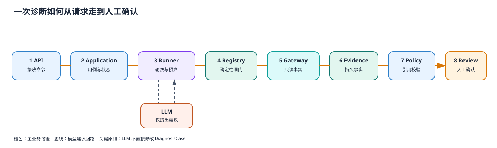

# 01｜一次诊断如何完成



> SVG：[learning-01-diagnosis-loop.svg](../01-architecture/learning-01-diagnosis-loop.svg)
> DOT：[learning-01-diagnosis-loop.dot](../01-architecture/learning-01-diagnosis-loop.dot)

## 1. 这份文档要教会你什么

你要能在 60 秒内说清：请求不是直接交给模型。Application Service 先建立诊断聚合，
Runner 只负责受预算约束的模型—工具循环，Registry 执行确定性闸门，工具把设备返回
转换成 EvidenceDraft，应用层再落成 Evidence。候选结论通过 CitationPolicy 后进入
`waiting_for_confirmation`，最后由 HumanReview 决定 confirmed 或 rejected。

不能误解为：LLM 调用工具后直接修改数据库，或者工具失败也会生成 Evidence。

## 2. 正常链路

```text
POST /diagnoses
  → SecurityDiagnosisApplicationService.create_diagnosis()
  → Repository.save()，新 Case version 0→1

POST /diagnoses/{id}/run
  → run_diagnosis() 读取独立聚合副本
  → Case: created → investigating
  → ToolLoopRunner.run()
      → LLMRequest（受限上下文 + 工具目录）
      → ToolRegistry.execute()
      → Tool → DeviceGateway → ToolEvidenceDraft
      → 失败 observation 返回模型，但失败不产生 EvidenceDraft
  → Application 将 Draft 转成 DiagnosisEvidence
  → 修复/校验 cited_evidence_ids
  → CitationPolicy.validate()
  → Case.set_conclusion()
  → Case: investigating → waiting_for_confirmation
  → Repository.update()（CAS）

POST /diagnoses/{id}/review
  → review_diagnosis()
  → Case.apply_human_review()
  → confirm / reject / request_more_info
```

Application Service 是用例所有者。Runner 不允许改变 Case，Tool 不允许持久化 Case，
LLM 不拥有状态迁移权。

## 3. 核心代码索引与阅读顺序

| 顺序 | 文件与符号 | 阅读重点 |
|---|---|---|
| 1 | `api/routes/diagnoses.py::create_diagnoses_router` | API 只做身份角色、DTO 和状态码映射 |
| 2 | `application/diagnoses.py::create_diagnosis` | Case 创建、支持故障域预检、首次保存 |
| 3 | `application/diagnoses.py::run_diagnosis` | 状态迁移、Runner 调用、Evidence 落地、引用校验、CAS 更新 |
| 4 | `agent/runner.py::ToolLoopRunner.run` | 轮次、工具次数、消息字符数、截止时间、allowlist |
| 5 | `tools/registry.py::ToolRegistry.execute` | 注册、只读限制、权限、故障域、参数模型与受控失败 |
| 6 | `tools/device_stream.py::DeviceStreamTool._execute` | Gateway 事实如何变成 EvidenceDraft |
| 7 | `application/diagnoses.py::to_diagnosis_evidence` | Draft 如何获得真实 evidence_id 和 diagnosis 归属 |
| 8 | `domain/citation_policy.py::CitationPolicy.validate` | 结论引用的确定性门禁 |
| 9 | `application/diagnoses.py::review_diagnosis` | 人工动作如何进入聚合并持久化 |

推荐实际操作：在 `run_diagnosis()`、`ToolLoopRunner.run()`、
`ToolRegistry.execute()` 和 `CitationPolicy.validate()` 各下一个断点，运行
`tests/api/test_diagnoses_api.py::test_full_closed_loop`。

## 4. 四个必须掌握的不变量

1. **Runner 无状态所有权**：它返回 `ToolLoopResult`，不能调用 `case.add_evidence()`。
2. **Registry 不可绕过**：`BaseTool.run()` 要求 Registry 注入的调用标记。
3. **失败不伪造事实**：失败结果的 `evidence_drafts` 必须为空。
4. **候选不等于确认**：模型停止只表示推理结束，不表示业务确认。

## 5. 失败路径怎么走

| 失败 | 发生层 | 系统行为 |
|---|---|---|
| 模型超时/空响应 | Runner | 返回受控失败；Case 进入可补充信息状态 |
| 模型请求白名单外工具 | Runner/Registry | 拒绝执行，记录安全 observation |
| 工具参数非法 | Registry | Pydantic 校验失败，不调用 Gateway |
| Gateway 超时 | Tool | 映射稳定 failure_kind，不生成 Evidence |
| 引用未知 Evidence | CitationPolicy | 拒绝候选结论，不进入待确认 |
| CAS 冲突 | Repository | 抛 `ConcurrentUpdateError`，不自动重放 Agent 或 Review |

## 6. 配套测试

```powershell
uv run pytest tests/agent/test_runner.py -q
uv run pytest tests/tools/test_registry.py -q
uv run pytest tests/application/test_diagnosis_service.py -q
uv run pytest tests/api/test_diagnoses_api.py -q
```

先读成功测试，再读以下失败语义：预算耗尽、白名单拒绝、失败无 Evidence、引用非法、
并发冲突不重放。

## 7. 上帝视角追问与答案

### Q1：为什么 Runner 不直接接收 Case？

**答案：** Runner 是推理循环，不是事务边界。如果它持有 Case，就能在模型循环中
修改状态、证据或结论，使重试、超时和工具失败留下半成品。当前设计让 Runner 只返回
Draft，Application 在一个明确阶段完成落地、校验和 CAS 更新。

```text
错误设计：LLM Loop ──直接写──> Case/DB
当前设计：LLM Loop ──Draft──> Application ──Policy/CAS──> Case/DB
```

### Q2：工具失败为什么还要把 observation 返回模型？

**答案：** 失败也是控制信息，模型可以停止、换用已授权工具或承认事实不足；但失败
不是设备事实，所以不能生成 Evidence。这样兼顾可恢复推理与证据可信度。

### Q3：为什么不用一个大函数完成整条链路？

**答案：** 大函数能更快做 Demo，但无法独立验证权限、预算、状态机、引用和持久化。
分层的代价是对象较多，收益是每个边界都有可执行测试，且真实设备接入不需要改模型循环。

### Q4：如果删除 CitationPolicy，已有 Evidence 是否仍足够可信？

**答案：** 不够。Evidence 本身可信，不代表结论引用正确。模型仍可能引用其他诊断、
不存在的 ID，或仅凭 SOP 生成 probable。事实真实性和推理引用合规是两个独立问题。

### Q5：这条链路的扩展瓶颈在哪里？

**答案：** 当前同步 Runner 与 SQLite 适合单机 Harness。更大规模需要任务队列、可恢复
执行、分布式幂等和更强存储，但不能因此取消 Registry、Evidence、Policy 和 Review。

## 8. 面试表达

> 我没有让模型直接操作诊断聚合。模型只在 ToolLoopRunner 中提出工具调用和候选结论；
> ToolRegistry 负责白名单、权限、参数和只读约束，工具结果先形成 EvidenceDraft，再由
> Application Service 落成真实 Evidence。结论经过引用策略后只进入待人工确认状态，
> 最终 confirmed 由 HumanReview 驱动。这样即使模型或设备调用失败，也不会伪造事实或
> 留下半更新状态。

## 9. 自测

不看文档回答：

1. 工具超时后为什么没有 Evidence？
2. Runner 与 Application Service 的职责边界是什么？
3. `probable` 候选在哪一层校验？
4. CAS 冲突后为什么不能自动重跑 Agent？
5. 从 API 到 confirmed 画出不超过 10 个节点的流程图。
