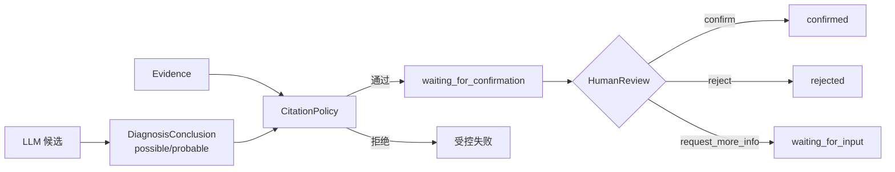

# 链路二：模型为何不能直接确认

## 1. 先建立正确心智模型

LLM 的输出是**候选诊断**，不是业务事实，更不是最终责任认定。系统把三个概念拆开：

| 概念 | 产生者 | 能否直接变成 `confirmed` |
| --- | --- | --- |
| Evidence | 只读工具成功结果 | 否 |
| DiagnosisConclusion | LLM/规则给出的候选结论 | 否，最高只能 `probable` |
| HumanReview | 有身份的人工复核 | 是，且必须走 Case 状态机 |

## 2. 四道不可绕过的门

### 2.1 结论模型限制可信度

入口是 [`domain/conclusion.py`](../../src/security_diagnosis_harness/domain/conclusion.py) 的
`DiagnosisConclusion`。模型侧只能表达 `possible` 或 `probable`，`confirmed` 不属于候选结论的
合法可信度。

### 2.2 Case 检查归属与状态

[`SecurityDiagnosisCase.set_conclusion()`](../../src/security_diagnosis_harness/domain/case.py)
在写入前检查：

1. `diagnosis_id` 必须属于当前 Case；
2. `fault_type` 必须一致，防止摄像头结论污染录像诊断；
3. 引用必须属于当前聚合；
4. 当前状态必须允许设置结论。

异常必须发生在赋值与 `_touch()` 之前，所以失败不能留下“半写入”。

### 2.3 CitationPolicy 检查证据强度

[`CitationPolicy.validate()`](../../src/security_diagnosis_harness/domain/citation_policy.py)
不是关键词检查，而是结构化约束：

- 所有候选结论至少引用一条当前诊断 Evidence；
- `probable` 至少引用规定数量、规定类型的设备事实；
- 只有知识 SOP 不足以支撑高可信设备事实；
- 跨诊断、未知 Evidence ID、跨故障域结论都会被拒绝。

### 2.4 HumanReview 才推进最终状态

[`apply_human_review()`](../../src/security_diagnosis_harness/domain/case.py) 接受
[`HumanReview`](../../src/security_diagnosis_harness/domain/review.py)，依据动作推进到
`confirmed`、`rejected` 或 `waiting_for_input`。这条路径保留 reviewer、comment、时间戳与
review_id，形成责任链。

## 3. 正常链路与攻击链路

| 场景 | 结果 | 原因 |
| --- | --- | --- |
| probable + 足够设备事实 + 人工 confirm | confirmed | 完整闭环 |
| LLM 伪造 confirmed | 构造/策略阶段拒绝 | 模型无该权限 |
| 摄像头 Case 引用录像结论 | 拒绝且 Case 不变 | 跨 fault_type 不变量 |
| probable 只引用 knowledge_sop | 拒绝或降级 | 知识不是现场设备事实 |
| review 直接作用于 created | 拒绝 | 状态机不允许跳转 |
| CAS 冲突后自动重复人工确认 | 禁止 | 可能重放副作用与责任动作 |

## 4. 关键代码走读顺序

1. [`domain/conclusion.py`](../../src/security_diagnosis_harness/domain/conclusion.py)：候选结论能表达什么。
2. [`domain/citation_policy.py`](../../src/security_diagnosis_harness/domain/citation_policy.py)：什么证据能支撑什么可信度。
3. [`domain/case.py`](../../src/security_diagnosis_harness/domain/case.py)：状态、不变量、最终确认。
4. [`application/diagnoses.py`](../../src/security_diagnosis_harness/application/diagnoses.py)：应用层怎样按顺序调用规则。
5. [`api/routes/diagnoses.py`](../../src/security_diagnosis_harness/api/routes/diagnoses.py)：人工复核怎样进入系统。

## 5. 上帝视角追问与答案

### Q1：既然规则很严格，为什么还要人工确认？

**答案：** CitationPolicy 只能证明“结论引用了足够且归属正确的证据”，不能证明现实世界中
结论一定正确。设备事实可能过期、协议实现可能有缺陷、规则可能漏掉业务语境。人工确认负责
最终责任认定，策略负责把进入人工队列的候选质量控制在可接受范围。

### Q2：为什么不让模型输出 `confirmed`，再由后端验证？

**答案：** 这会让领域词义失真。`confirmed` 表示“经过有身份主体确认”，不是“模型很自信”。
即使后端最终拒绝，大量日志、指标与调用方仍可能把模型字段误当成最终状态。最稳妥的设计是
让候选模型从类型层就无法表达该状态。

### Q3：CitationPolicy 应该放 Application 还是 Domain？

**答案：** 证据归属和可信度是领域规则，应放 Domain；“何时调用、失败后如何保存、返回什么
HTTP 状态”属于 Application/API。Case 自身再保留关键归属不变量，避免有人绕过应用服务。

### Q4：为什么并发冲突不能自动重跑 review？

**答案：** review 是带身份和责任的业务动作。冲突意味着它所依据的聚合版本已经变化，自动
重放可能在新证据、新结论或已终态 Case 上重复确认。正确做法是返回 409，让调用方刷新后重新
明确决策。

### Q5：如果没有人工，系统是不是毫无用处？

**答案：** 不是。它仍可完成事实采集、候选分类、证据组织、排障顺序和报告生成；只是最终状态
停在 `waiting_for_confirmation`。这是“自动化辅助决策”，而不是伪装成无人监管的自主裁决。

## 6. 绝不能误解

- `probable` 不是“差一点 confirmed”，而是机器候选的最高等级。
- 引用 ID 存在不代表引用合规，还要检查归属、类型和强度。
- HumanReview 不是前端按钮装饰，而是唯一确认入口。
- 状态机、策略和类型约束是互补防线，不是重复代码。

## 7. 自测

1. 为什么 knowledge_sop 不能单独支撑 probable？
2. `fault_type` 不一致应该在哪两层被拒绝？
3. 人工确认与模型高置信度在语义上有什么根本差异？
4. 为什么 CAS 冲突应返回 409 而不是自动重试？
