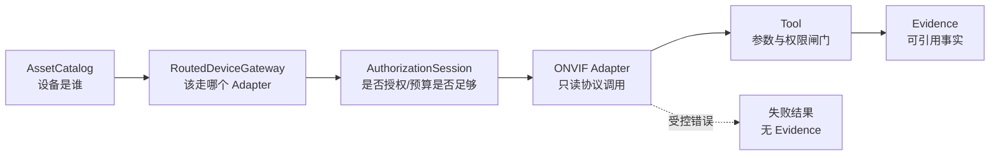

# 链路三：设备事实如何安全进入系统

## 1. 目标不是“能连设备”，而是“受控地得到事实”

正式路径把设备访问拆成六层，每层只解决一个问题：

“网络能访问”只回答连通性；Asset、Capability、Authorization、Read-only、Budget 与 Evidence
provenance 才共同回答这次访问是否合规、结果是否可用。

## 2. 每一层的职责

| 层 | 关键代码 | 负责 | 不负责 |
| --- | --- | --- | --- |
| AssetCatalog | [`adapters/device_assets/in_memory.py`](../../src/security_diagnosis_harness/adapters/device_assets/in_memory.py) | 资产、启用状态、能力、连接配置 | 发网络请求 |
| Adapter Registry | [`adapters/device_gateway/registry.py`](../../src/security_diagnosis_harness/adapters/device_gateway/registry.py) | 确定性注册与选择 Adapter | 猜测设备能力 |
| Router | [`adapters/device_gateway/routed.py`](../../src/security_diagnosis_harness/adapters/device_gateway/routed.py) | 资产/能力/就绪度预检与路由 | 伪造缺失事实 |
| Authorization | [`device_authorization.py`](../../src/security_diagnosis_harness/device_authorization.py) | scope、设备、操作、次数和期限预算 | 保存凭证 |
| ONVIF Adapter | [`adapters/device_gateway/onvif.py`](../../src/security_diagnosis_harness/adapters/device_gateway/onvif.py) | SOAP/HTTP Digest、响应解析、错误分类 | 业务结论 |
| Tool | [`tools/`](../../src/security_diagnosis_harness/tools) | 参数校验、permission、风险级别、EvidenceDraft | 直接改 Case |

## 3. 真机最小只读闭环

Phase 11D 验证的边界是：

1. WS-Discovery 找到设备服务；
2. HTTP Digest 获取 DeviceInformation；
3. 查询 Profiles；
4. 获取 Stream URI；
5. RTSP Digest OPTIONS 验证流端点协议可达。

这证明“授权 Wi-Fi 摄像头的最小只读协议链可工作”，**不证明**多品牌兼容、不证明视频内容
检测准确率，也不等于生产接入。详细证据见
[`Phase 11D 真机验收记录`](../04-validation/Phase%2011D%20真机验收记录.md)。

## 4. 为什么失败不能变成 Evidence

工具失败时返回结构化 failure，包括 timeout、authentication、rate_limited、invalid_response、
capability_missing 等分类；`evidence_drafts=[]`。原因是 Evidence 表示已经观察到的事实，不能把
“没有拿到事实”包装成“设备事实”。失败本身可以进入运行轨迹、指标和审计，但引用规则不可把它
当成诊断依据。

## 5. 授权预算如何理解

[`AuthorizationManifest`](../../src/security_diagnosis_harness/device_authorization.py) 是声明，
[`DeviceAuthorizationSession`](../../src/security_diagnosis_harness/device_authorization.py) 是运行时
消费记录。预检至少回答：

- 设备是否在授权范围；
- 操作是否在只读 allowlist；
- 授权是否过期；
- 单操作与总调用预算是否还有余额；
- 失败后是否允许重试。

HTTP/RTSP Digest 的 challenge-response 可能包含两次网络交换，所以“一个业务操作”与“一个网络
包”不能混为一谈。预算契约必须明确计量单位。

## 6. 失败矩阵

| 失败 | 应落在哪层 | 对 Agent 的表现 |
| --- | --- | --- |
| 资产不存在/禁用 | Router | 受控失败，不调用 Adapter |
| 能力缺失 | Router | capability_missing |
| Adapter 未就绪 | Registry/Router | adapter_unavailable |
| 认证失败 | Adapter | authentication |
| 超时/连接重置 | Adapter | timeout/transport |
| 限流 | Adapter/Router | rate_limited，不自动无限重试 |
| 部分事实 | Adapter/Tool | 只生成实际取得的事实，明确缺失字段 |
| XML 过大/结构异常 | Adapter parser | invalid_response，受资源边界保护 |

## 7. 关键测试入口

- [`tests/adapters/test_in_memory_device_asset_catalog.py`](../../tests/adapters/test_in_memory_device_asset_catalog.py)
- [`tests/adapters/test_device_adapter_registry.py`](../../tests/adapters/test_device_adapter_registry.py)
- [`tests/adapters/test_routed_device_gateway.py`](../../tests/adapters/test_routed_device_gateway.py)
- [`tests/test_device_authorization.py`](../../tests/test_device_authorization.py)
- [`tests/adapters/test_onvif_read_only_adapter.py`](../../tests/adapters/test_onvif_read_only_adapter.py)
- [`tests/tools/test_device_failure_mapping.py`](../../tests/tools/test_device_failure_mapping.py)

## 8. 上帝视角追问与答案

### Q1：为什么 Tool 不能直接持有摄像头 URL？

**答案：** URL 是基础设施配置，直接放进 Tool 会绕过资产状态、能力声明、Adapter 选择、授权预算
和脱敏策略，也让测试只能依赖网络。Tool 应表达业务动作，Gateway 负责访问方式。

### Q2：Router 与 Registry 为什么不能合并？

**答案：** Registry 解决“名字到实现的确定性映射”；Router 解决“这个资产、能力和运行状态下该不该
调用哪个实现”。分开后可以独立验证重复注册、未就绪、缺能力等错误，也避免 Registry 长成业务上帝类。

### Q3：为什么不在失败时生成 `device_unreachable` Evidence？

**答案：** 一次超时只证明本次调用没拿到响应，可能是本机网络、代理或预算造成。把它写成设备不可达
会把执行故障升级成设备事实。更可靠的做法是保留失败轨迹，只有具备明确观测语义的探针结果才成为 Evidence。

### Q4：Digest 为什么仍然需要安全边界？

**答案：** Digest 避免明文发送密码，但密码仍在本机内存参与摘要计算，challenge 与 URI 也可能泄露
设备信息。因此仍需最小权限、次数预算、日志脱敏和不落原始响应。

### Q5：Simulator 与真机证据如何避免混算？

**答案：** 报告必须携带 source/provenance 和 report_kind。Simulator 用于确定性回归与故障注入；
authorized-device 只证明授权设备上的特定协议闭环。发布门禁和结论不能把前者标成真机成功率。

## 9. 绝不能误解

- ONVIF 成功不等于 RTSP 成功，更不等于画面内容正常。
- Digest 不等于“无需授权与脱敏”。
- Simulator 是工程验证工具，不是真机替代品。
- Router 的降级必须显式，不能偷偷回落到静态假数据。

## 10. 自测

1. 一个设备请求在到达 ONVIF Adapter 前经过哪些门？
2. 业务操作预算与网络交换预算有什么区别？
3. 为什么 timeout 默认不产生 Evidence？
4. 真机 Phase 11D 到底证明了什么、没证明什么？
