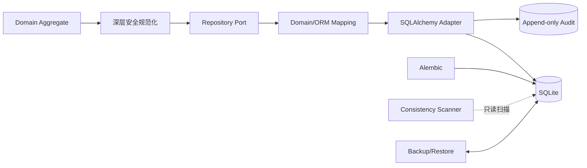

# 链路四：诊断数据如何可靠保存

## 1. 持久化不是“把对象塞进数据库”

本项目的可靠保存链路同时解决五件事：领域不依赖 ORM、敏感信息不落库、并发更新不丢失、状态变化
可审计、数据库可检查与恢复。



## 2. Port/Adapter 边界

[`ports/diagnosis_repository.py`](../../src/security_diagnosis_harness/ports/diagnosis_repository.py)
只描述 `save/get/list/update/exists/count` 的领域契约。Application 依赖 Port，不认识 Session、Row、Engine。
SQLite 实现在
[`adapters/persistence/diagnosis_repository.py`](../../src/security_diagnosis_harness/adapters/persistence/diagnosis_repository.py)，
ORM 行定义在 [`models.py`](../../src/security_diagnosis_harness/adapters/persistence/models.py)，转换集中在
[`mapping.py`](../../src/security_diagnosis_harness/adapters/persistence/mapping.py)。

好处不是“换数据库更方便”这么简单，而是让领域测试无需数据库、基础设施异常不泄漏、ORM 生命周期
无法污染业务对象。

## 3. 深层脱敏为何必须发生在写入前

Pydantic 构造期 validator 不足以阻止对象构造后被原地修改。持久化边界因此执行：

```text
原聚合 model_dump(mode="python")
        ↓ 独立副本
Domain.model_validate(...)
        ↓ 所有嵌套 validator 重跑
安全聚合 → ORM columns
```

入口见 [`domain/aggregate_sanitization.py`](../../src/security_diagnosis_harness/domain/aggregate_sanitization.py)
与 [`domain/redaction.py`](../../src/security_diagnosis_harness/domain/redaction.py)。调用方对象不被修改，落库副本
已脱敏；Evidence 的 `content_hash` 基于脱敏后的最终内容重算。

## 4. CAS 乐观锁如何阻止丢失更新

聚合带 `version`。首次保存从 0 落成 1；更新执行：

```sql
UPDATE diagnosis_cases
SET ..., version = :expected + 1
WHERE diagnosis_id = :id AND version = :expected;
```

- `rowcount == 1`：提交并返回新版本副本；
- `rowcount == 0` 且 ID 不存在：NotFound；
- `rowcount == 0` 且 ID 存在：ConcurrentUpdateError；
- execute/commit 的 SQLAlchemy 异常：rollback 后映射为 RepositoryPersistenceError。

它叫**冲突检测**，不是“完全并发安全”：不提供自动合并、串行化或分布式锁。尤其 Agent 和人工 review
冲突后不得自动重放，因为外部事实与人工意图可能已经变化。

## 5. 迁移、审计、一致性与恢复

| 能力 | 入口 | 关键保证 |
| --- | --- | --- |
| Schema 迁移 | [`migrations/`](../../migrations) | 由 Alembic 版本化，不用 `create_all` 冒充迁移 |
| 追加式审计 | [`audited_write.py`](../../src/security_diagnosis_harness/adapters/persistence/audited_write.py) | 业务写入与审计事件建立可追踪关系 |
| 审计仓储 | [`audit_repository.py`](../../src/security_diagnosis_harness/adapters/persistence/audit_repository.py) | 事件追加、不可当普通聚合覆盖 |
| 一致性扫描 | [`application/consistency.py`](../../src/security_diagnosis_harness/application/consistency.py) | 只读检查 Review/Evidence/Audit 归属与结构 |
| 备份恢复 | [`backup.py`](../../src/security_diagnosis_harness/adapters/persistence/backup.py) | 安全路径、可验证备份、受控恢复 |

一致性扫描不应“顺手修库”。扫描与修复分开，才能保留现场、降低误修风险并支持审计复核。

## 6. 上帝视角追问与答案

### Q1：为什么脱敏放 Domain 后，Adapter 还要规范化？

**答案：** Domain 构造期保证正常入口；Adapter 边界防构造后原地修改、旧对象或不受控调用者。两者复用
同一规则而非两套正则，所以是纵深防御，不是规则重复。

### Q2：为什么 Repository.update 返回新对象？

**答案：** 成功后的 version 是持久化结果的一部分。返回新副本既避免隐式修改调用方对象，也迫使应用层
显式接住最新版；否则后续继续使用旧 version 会制造假冲突。

### Q3：为什么冲突后不自动重跑 Runner？

**答案：** Runner 可能再次调用设备、改变成本、获得不同事实；review 更涉及责任动作。自动重跑不是简单的
数据库重试，而是重复业务流程。系统选择显式 409，让上层刷新后决定。

### Q4：审计日志为什么不能等同应用日志？

**答案：** 应用日志面向排障，可能采样、滚动或包含噪声；审计事件需要稳定身份、实体、动作、结果与时间语义，
并受追加约束。两者生命周期与可信目标不同。

### Q5：SQLite 适合生产吗？

**答案：** 本项目用它验证事务、迁移、CAS、审计、备份与重启恢复，适合单机 Harness 基线。它不证明多实例
高并发与高可用；若进入多节点部署，需要重新验证数据库隔离级别、连接池、备份和锁语义。

## 7. 关键验证

重点阅读 [`tests/persistence/`](../../tests/persistence)：round-trip、深层脱敏、CAS、异常映射、迁移、审计、
一致性扫描和备份恢复都应有反例测试。面试时不要只说“995+ 测试”，而要举一个具体失败注入：两个独立副本
从同一 version 更新，赢家保留、输家 409、聚合无半更新。

## 8. 绝不能误解

- 乐观锁只检测 stale write，不自动解决业务冲突。
- ORM JSON 列不意味着放弃领域类型；读回必须重新构造 Domain。
- “落库前脱敏”不允许用 Adapter 自创另一套规则。
- 备份文件生成成功不等于可恢复，必须验证恢复链路。

## 9. 自测

1. 构造后向 Evidence payload 注入密码，哪一层最后兜底？
2. `rowcount=0` 怎样区分不存在和并发冲突？
3. 为什么一致性扫描默认只读？
4. `create_all()` 为什么不能替代 Alembic？
