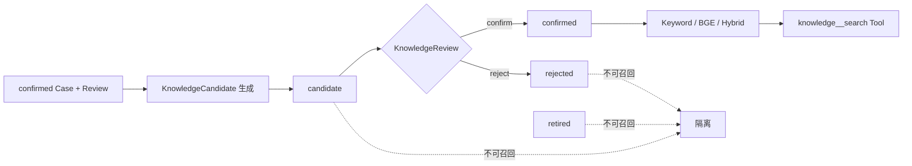

# 链路五：RAG 知识闭环如何工作

## 1. RAG 的重点先是治理，再是向量

本项目不是把诊断报告直接塞进向量库。知识先从已确认诊断生成候选，经过人工治理成为 confirmed，随后才
能被 Keyword、BGE 或 Hybrid Retriever 召回。

## 2. 从诊断到知识候选

[`application/knowledge_candidates.py`](../../src/security_diagnosis_harness/application/knowledge_candidates.py)
从 Case、结论、引用 Evidence 与 Review 组织 `KnowledgeCandidate`；
[`knowledge_governance.py`](../../src/security_diagnosis_harness/application/knowledge_governance.py)
负责保存与评审流程；领域状态机位于
[`domain/knowledge.py`](../../src/security_diagnosis_harness/domain/knowledge.py)。

生成入口必须要求来源诊断已被人工确认，并保留：source_diagnosis_id、source_conclusion_id、
source_evidence_ids、故障域、症状、根因、排障步骤与排除项。这样检索结果可追溯，不是孤立文本块。

## 3. 为什么 candidate 绝不能被召回

候选知识尚未经过治理，可能包含误判、偶然相关性或不完整步骤。如果它进入检索，再影响下一次诊断，就会
形成“模型猜测 → 写入知识 → 模型引用自身猜测”的反馈污染。Repository 的 `search_confirmed()` 与检索层都
必须限制状态，形成双重保护。

## 4. 三种检索路径

| 路径 | 优势 | 弱点 | 适合 |
| --- | --- | --- | --- |
| Keyword | 可解释、确定、无需服务 | 同义表达召回差 | 精确告警码、设备字段 |
| BGE Vector | 语义相似、能跨措辞 | 依赖 embedding 服务、可能语义漂移 | 自然语言症状 |
| Hybrid | 兼顾词法与语义 | 融合权重需评测 | 正式默认候选 |

核心实现位于
[`application/hybrid_knowledge_retriever.py`](../../src/security_diagnosis_harness/application/hybrid_knowledge_retriever.py)，
Embedding Port 的 HTTP BGE 实现在
[`adapters/embedding/http_bge.py`](../../src/security_diagnosis_harness/adapters/embedding/http_bge.py)。BGE 被设计为
独立本机服务，其他项目可复用，主服务未启动时不应被隐式拉起。

## 5. Hybrid 不是“把两个分数相加”就结束

需要明确：候选集合、分数归一化、权重、tie-break、limit、fault_type 过滤、状态过滤和 embedding 失败降级。
离线 `FakeEmbeddingAdapter` 用于确定性测试；真实 BGE 结果必须单独标记，不能与 Fake 指标混算。

## 6. 知识 Evidence 与设备 Evidence 的差异

`knowledge_sop` 能说明“过去如何处理过相似问题”，不能证明“当前设备现在就是这个故障”。因此它可以辅助
`possible` 候选、提供排障顺序，但不能单独支撑 `probable`。这是 RAG 与 CitationPolicy 之间最重要的接口。

## 7. 上帝视角追问与答案

### Q1：为什么不直接把所有 confirmed 报告向量化？

**答案：** 报告面向人读，可能含重复模板、审计信息和场景噪声。KnowledgeCandidate 是治理后的检索单元，
字段结构稳定、来源可追溯、生命周期可管理。向量化只是索引方式，不代替知识建模。

### Q2：为什么 confirmed 知识以后还需要 retired？

**答案：** 设备固件、平台策略和 SOP 会变化。历史知识曾经正确不代表永久有效；retired 让它保留审计历史但
退出召回，优于物理删除。

### Q3：BGE 服务不可用时怎么办？

**答案：** 失败必须可观测并受策略控制。可选择明确降级到 Keyword，但报告要标注实际 retriever；不能返回
Hybrid 名义指标，也不能启动隐藏的外部依赖。

### Q4：怎样证明 Hybrid 更好？

**答案：** 在固定、版本化、答案不泄漏的数据集上分别运行 Keyword/Vector/Hybrid，比较 Recall@K、MRR 等，
保留每条 query 的排名证据。当前小型固定集只能建立回归基线，不能声称广泛真实效果。

### Q5：RAG 能替代设备工具吗？

**答案：** 不能。RAG 提供历史经验和 SOP，设备工具提供现场事实。两者在 EvidenceType 与引用策略上刻意分离，
避免经验被误当现场观测。

## 8. 关键代码与测试

- [`domain/knowledge.py`](../../src/security_diagnosis_harness/domain/knowledge.py)
- [`ports/knowledge_repository.py`](../../src/security_diagnosis_harness/ports/knowledge_repository.py)
- [`adapters/knowledge/in_memory.py`](../../src/security_diagnosis_harness/adapters/knowledge/in_memory.py)
- [`adapters/persistence/knowledge_repository.py`](../../src/security_diagnosis_harness/adapters/persistence/knowledge_repository.py)
- [`domain/knowledge_retrieval.py`](../../src/security_diagnosis_harness/domain/knowledge_retrieval.py)
- [`tests/test_eval_phase5.py`](../../tests/test_eval_phase5.py)

## 9. 绝不能误解

- BGE 是 embedding 模型，不是会自动回答问题的知识库。
- 向量相似不等于事实正确。
- confirmed 是治理状态，不是永不过期。
- FakeEmbedding 指标不能冒充真实 BGE 指标。

## 10. 自测

1. candidate 被召回会造成什么反馈污染？
2. Hybrid 的哪些细节会影响可复现性？
3. 为什么 knowledge_sop 不能单独支撑 probable？
4. BGE 独立服务设计有什么复用和故障隔离价值？
