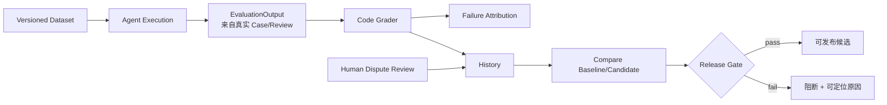

# 链路六：评测如何决定能否发布

## 1. 评测不是项目末尾的一条 pytest

测试回答“代码是否符合已知契约”；Agent 评测回答“在固定业务案例上，系统能力相对基线是进步还是退步”。
发布门禁再把指标、证据完整性和风险阈值变成可执行决策。

## 2. 数据集先于指标

[`evaluation/dataset.py`](../../src/security_diagnosis_harness/evaluation/dataset.py) 定义案例与 Registry。Dev 用于日常
调优，Validation 用于策略/版本比较，Test 保持未见性用于最终确认。答案不得出现在模型提示词中；真实模型只拿
候选标签集合、允许工具与 Evidence 类型等约束。

数据集必须版本化并发布验证，入口见
[`evaluation/release.py`](../../src/security_diagnosis_harness/evaluation/release.py) 的 `publish_dataset_version()` 与
`verify_dataset_release()`。否则“同一指标”可能其实来自不同案例。

## 3. EvaluationOutput 必须来自系统事实

[`evaluation/grader.py`](../../src/security_diagnosis_harness/evaluation/grader.py) 的 EvaluationOutput 应从真实 Case、
Evidence、Conclusion、Review 与工具轨迹生成，不能让执行者自报“我已人工确认”或“引用合规”。这种字段必须由
grader 依据结构复算，否则门禁可被伪造。

## 4. 分开评分，才能定位问题

| 指标 | 回答的问题 |
| --- | --- |
| candidate accuracy / macro-F1 | 标签判断是否正确，且是否照顾小类 |
| tool precision | 调用的工具里有多少必要 |
| tool recall | 应调用的工具是否漏掉 |
| evidence compliance | Evidence 类型、来源、引用是否合规 |
| evidence recall | 关键事实是否收集齐 |
| workflow success | 多步链路是否完成 |
| latency/calls/tokens | 完成任务的效率和成本 |
| human review rate | 多少案例仍需人工争议处理 |

宏 F1 必须从逐案例混淆矩阵复算；空集 rate 的语义要显式，不能因除零随意给 1.0。

## 5. 失败归因与历史比较

[`evaluation/attribution.py`](../../src/security_diagnosis_harness/evaluation/attribution.py) 把失败归到模型输出、工具选择、
设备事实、引用、工作流或基础设施，而不是只留下“case failed”。
[`evaluation/history.py`](../../src/security_diagnosis_harness/evaluation/history.py) 保存可比较运行；
[`evaluation/gate.py`](../../src/security_diagnosis_harness/evaluation/gate.py) 的 `compare_runs()` 与 GatePolicy 将回归阈值
转成发布决定。

## 6. 证据来源不能混算

| 来源 | 能证明 | 不能证明 |
| --- | --- | --- |
| Static/Fake | 逻辑与契约确定性 | 网络/协议真实性 |
| Simulator/Toxiproxy | 故障映射、超时降级、循环稳定 | 厂商兼容和真实准确率 |
| Real model | 特定模型在固定案例的结构化表现 | 生产总体准确率 |
| Authorized device | 授权设备上的指定只读协议闭环 | 多设备、多厂商、线上 SLA |

报告必须携带 report_kind/provenance；不可得 token 保持 `null`，不能填 0；脚本遇到门禁失败必须返回非零退出码，
否则 CI 会把失败当成功。

## 7. 上帝视角追问与答案

### Q1：为什么 pytest 通过还需要 Agent eval？

**答案：** pytest 验证确定性代码契约，例如超时是否映射正确；eval 验证组合行为，例如模型是否选对工具、Evidence
是否足够、标签是否正确。Agent 的失败常来自组件组合与非确定输出，单元测试覆盖不了能力变化。

### Q2：为什么不能只看最终标签准确率？

**答案：** 同样答对，可能一个 Agent 调了 10 个无关工具、引用了错误事实，另一个以 3 个必要工具完成。只看标签会
掩盖成本、安全和偶然命中；分项指标才能定位改 prompt、工具还是规则。

### Q3：模型给出语义等价标签怎么办？

**答案：** 标准枚举仍严格校验，未知标签不能自动篡改数据集；语义等价进入人工争议复核，形成可审计裁决。否则每次
为了迎合模型改答案，基线失去意义。

### Q4：发布门禁为何必须可复算？

**答案：** 门禁是治理决策。若核心指标由脚本直接自报、无法由逐案例记录重建，任何错误或篡改都可能放行。可复算性
让审查者从原始输出重建汇总指标，并验证数据集版本、grader 版本和来源。

### Q5：真实模型 Validation 1.0 能否写“准确率 100%”？

**答案：** 只能说“在版本化 Validation Set 的两条受限案例上为 2/2”，并附模型、提示协议与调用边界。样本太小，
不能外推生产准确率。

## 8. 关键代码索引

- [`evaluation/dataset.py`](../../src/security_diagnosis_harness/evaluation/dataset.py)
- [`evaluation/grader.py`](../../src/security_diagnosis_harness/evaluation/grader.py)
- [`evaluation/attribution.py`](../../src/security_diagnosis_harness/evaluation/attribution.py)
- [`evaluation/history.py`](../../src/security_diagnosis_harness/evaluation/history.py)
- [`evaluation/gate.py`](../../src/security_diagnosis_harness/evaluation/gate.py)
- [`evaluation/release.py`](../../src/security_diagnosis_harness/evaluation/release.py)
- [`scripts/eval_phase7_real_model.py`](../../scripts/eval_phase7_real_model.py)

## 9. 绝不能误解

- 固定评测是回归证据，不是生产准确率。
- `null` 表示不可得，0 表示确实测得零，两者不能混用。
- Release Gate 不是替代人工，而是阻止已知退化进入下一阶段。
- Test Set 若反复用于调参，就不再是 Test Set。

## 10. 自测

1. 为什么指标必须能从逐案例记录复算？
2. tool precision 与 recall 分别揭示什么问题？
3. Simulator 和授权真机证据如何隔离？
4. 为什么真实模型 2/2 不能表述为生产准确率 100%？
