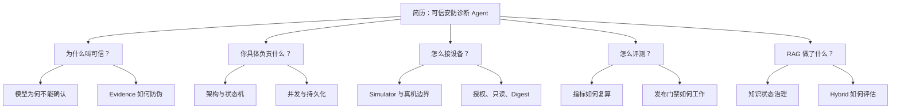

# 基于简历的面试追问树

## 使用规则

第一层问题只允许来自简历文字与候选人职责；只有你的回答提到某个设计后，面试官才自然进入下一层。
这比“上来问 CitationPolicy 第 72 行”更接近真实面试。

建议先闭卷回答本页，再逐题对照
[`08-完整标准答案库.md`](./08-完整标准答案库.md)。答案库覆盖本页全部主问题与追问。

## 主干一：可信性

1. **你为什么把项目称为“可信 Agent”？**
   - 追问：模型到底能做什么、不能做什么？
   - 再追问：如果模型输出 confirmed 怎么办？
   - 压力追问：这些规则是不是硬编码，何必用 LLM？

2. **如何避免模型引用不存在或不相关的证据？**
   - 追问：Evidence 从哪里产生？工具失败算不算 Evidence？
   - 再追问：knowledge_sop 为什么不能支持 probable？

3. **人工确认会不会只是一个形式按钮？**
   - 追问：身份、状态机、并发冲突和审计如何落地？

## 主干二：工程职责

1. **这个项目里你最核心的三项工作是什么？**
   - 建议回答：可信诊断链、设备接入边界、评测发布闭环。
2. **为什么选 Ports & Adapters？**
   - 追问：Port 与 Adapter 在项目里分别举例。
   - 反问：是不是过度设计？
3. **遇到过最有价值的设计漏洞是什么？**
   - 建议选择：构造后敏感字段注入、跨故障域结论、stale update 丢失更新、不可复算指标。

## 主干三：设备接入

1. **没有大量真机，怎么证明设备链路不是 Demo？**
2. **Simulator、Toxiproxy、本机契约服务各模拟什么？**
3. **真机验证到什么程度？**
4. **为什么只做只读？怎样保证没有写操作？**
5. **HTTP Digest 与 RTSP Digest 遇到了什么兼容问题？**

## 主干四：数据与并发

1. **为什么先用内存仓储，后来切 SQLite？**
2. **CAS 乐观锁怎么实现？冲突后为什么不重试？**
3. **脱敏为何不是保存前 replace 一下？**
4. **审计、一致性扫描和备份分别解决什么问题？**

## 主干五：RAG

1. **RAG 在这个系统里到底贡献了什么？**
2. **为什么只有 confirmed 知识可检索？**
3. **Keyword、BGE、Hybrid 如何选？**
4. **怎样避免历史误判污染后续诊断？**

## 主干六：评测

1. **你怎么知道改完 Agent 是进步还是退步？**
2. **为什么不能只看最终准确率？**
3. **模型输出语义等价但不在枚举中怎么办？**
4. **固定案例、真实模型、Simulator 和真机证据如何隔离？**
5. **哪些指标能进入 Release Gate，如何防伪？**

## 推荐回答结构

每个问题用同一骨架：

1. 先讲结论；
2. 讲一次真实失败或风险；
3. 讲设计约束；
4. 讲测试/评测证据；
5. 主动说边界。

示例：“我们用 CAS 阻止陈旧副本覆盖新状态（结论）。旧实现两个副本会丢失更新（风险）。更新条件带 id+version，
rowcount=0 区分 NotFound 和 Conflict（设计）。内存与 SQLite 都有 winner/loser 测试（证据）。但它不是分布式锁，
也不自动合并冲突（边界）。”
